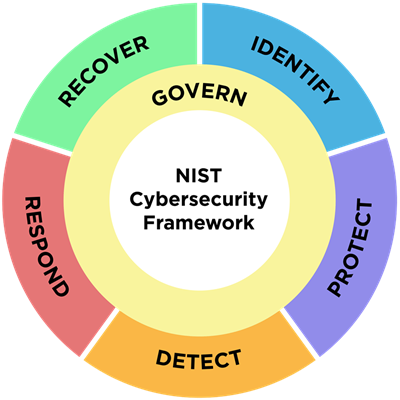
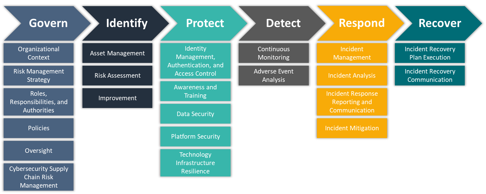

# __Introduction__

## NIST Cybersecurity Framework (CSF)

>> \
>>_Cybersecurity risks are expanding constantly, and managing those risks must be a continuous process. This is true regardless of whether an organization is just beginning to confront its cybersecurity challenges or whether it has been active for many years with a sophisticated, well-resourced cybersecurity team._
>>
>>\- _[NIST](https://nvlpubs.nist.gov/nistpubs/CSWP/NIST.CSWP.29.pdf)_

>>\
>>_Cybersecurity is the guardian of our digital realm, preserving the confidentiality, integrity and availability of our data. It's the defensive frontline protecting supply chains, physical infrastructure and external networks against unauthorized access and lurking threats.  Organizations that prioritize cyber resilience are better equipped to withstand attacks, minimize operational disruptions, and maintain trust with stakeholders._
>>
>>\- _[Accenture](https://www.accenture.com/us-en/insights/cyber-security-index)_

Organizations must have a framework for how they deal with both attempted and successful cyber attacks. One well-respected model, the NIST Cybersecurity Framework (CSF), explains how to identify attacks, protect systems, detect and respond to threats, and recover from successful attacks. 

Like NIST's CSF, the intended audience for this application tool include individuals:
>>\
>>_responsible for developing and leading cybersecurity programs and/or involved in managing risk — including executives, boards of directors, acquisition professionals, technology professionals, risk managers, lawyers, human resources specialists, and cybersecurity and risk management auditors — to guide their cybersecurity-related decisions._
>>
>>\- _[National Institute of Standards and Technology (NIST)](https://nvlpubs.nist.gov/nistpubs/CSWP/NIST.CSWP.29.pdf)_

Prioritizing cyber resilency starts with understanding an organization's current cybersecurity risks. This is achieved via the "Identify" function of the CSF and broken down into three (3) main categories:
* __Asset Management__:  "Assets (e.g., data, hardware, software, systems, facilities, services, people) that enable the organization to achieve business purposes are identified and managed consistent with their relative importance to organizational objectives and the organization's risk strategy" ([ID.AM](https://csrc.nist.gov/Projects/Cybersecurity-Framework/Filters#/csf/filters:~:text=Asset%20Management%20(ID.AM)%3A%20Assets%20(e.g.%2C%20data%2C%20hardware%2C%20software%2C%20systems%2C%20facilities%2C%20services%2C%20people)%20that%20enable%20the%20organization%20to%20achieve%20business%20purposes%20are%20identified%20and%20managed%20consistent%20with%20their%20relative%20importance%20to%20organizational%20objectives%20and%20the%20organization%27s%20risk%20strategy))
* __Risk Assessment__: "The cybersecurity risk to the organization, assets, and individuals is understood by the organization" ([ID.RA](https://csrc.nist.gov/Projects/Cybersecurity-Framework/Filters#/csf/filters:~:text=Risk%20Assessment%20(ID.RA)%3A%20The%20cybersecurity%20risk%20to%20the%20organization%2C%20assets%2C%20and%20individuals%20is%20understood%20by%20the%20organization))
* __Improvement__:  "Improvements to organizational cybersecurity risk management processes, procedures and activities are identified across all CSF Functions" ([ID.IM](https://csrc.nist.gov/Projects/Cybersecurity-Framework/Filters#/csf/filters:~:text=Improvement%20(ID.IM)%3A%20Improvements%20to%20organizational%20cybersecurity%20risk%20management%20processes%2C%20procedures%20and%20activities%20are%20identified%20across%20all%20CSF%20Functions))

## Project Objective 

#### Prototype a tool that supports _asset management_ and _risk assessment_ within the __Identify__ function of NIST's Cybersecurity Framework.
\
The tool will support _asset management_ by:
* ingesting user-defined common platform enumerations (CPE) using NIST's CPE API to inventory
    * "hardware managed by the organization" ([ID.AM-01](https://csrc.nist.gov/Projects/Cybersecurity-Framework/Filters#/csf/filters:~:text=ID.AM%2D01%3A%20Inventories%20of%20hardware%20managed%20by%20the%20organization%20are%20maintained))
    * "software, services, and systems managed by the organization" by  ([ID.AM-02](https://csrc.nist.gov/Projects/Cybersecurity-Framework/Filters#/csf/filters:~:text=ID.AM%2D02%3A%20Inventories%20of%20software%2C%20services%2C%20and%20systems%20managed%20by%20the%20organization%20are%20maintained))
    * "services provided by suppliers" ([ID.AM-04](https://csrc.nist.gov/Projects/Cybersecurity-Framework/Filters#/csf/filters:~:text=ID.AM%2D04%3A%20Inventories%20of%20services%20provided%20by%20suppliers%20are%20maintained))
* prioritizing assets "based on classification, criticality, resources, and impact on the mission" ([ID.AM-05](https://csrc.nist.gov/Projects/Cybersecurity-Framework/Filters#/csf/filters:~:text=ID.AM%2D05%3A%20Assets%20are%20prioritized%20based%20on%20classification%2C%20criticality%2C%20resources%2C%20and%20impact%20on%20the%20mission))

The tool will support _risk assessment_ by:
* identifying, validating, and recording "vulnerabilities in assets" using NIST's Common Vulnerabilities & Exploitations (CVE) API ([ID.RA-01](https://csrc.nist.gov/Projects/Cybersecurity-Framework/Filters#/csf/filters:~:text=ID.RA%2D01%3A%20Vulnerabilities%20in%20assets%20are%20identified%2C%20validated%2C%20and%20recorded); [ID.RA-02](https://csrc.nist.gov/Projects/Cybersecurity-Framework/Filters#/csf/filters:~:text=ID.RA%2D02%3A%20Cyber%20threat%20intelligence%20is%20received%20from%20information%20sharing%20forums%20and%20sources))
* analyzing vulnerability risks via: ([ID.RA-04](https://csrc.nist.gov/Projects/Cybersecurity-Framework/Filters#/csf/filters:~:text=ID.RA%2D04%3A%20Potential%20impacts%20and%20likelihoods%20of%20threats%20exploiting%20vulnerabilities%20are%20identified%20and%20recorded); [ID.RA-06](https://csrc.nist.gov/Projects/Cybersecurity-Framework/Filters#/csf/filters:~:text=ID.RA%2D06%3A%20Risk%20responses%20are%20chosen%2C%20prioritized%2C%20planned%2C%20tracked%2C%20and%20communicated); [ID.RA-07](https://csrc.nist.gov/Projects/Cybersecurity-Framework/Filters#/csf/filters:~:text=ID.RA%2D07%3A%20Changes%20and%20exceptions%20are%20managed%2C%20assessed%20for%20risk%20impact%2C%20recorded%2C%20and%20tracked); [ID.RA-08](https://csrc.nist.gov/Projects/Cybersecurity-Framework/Filters#/csf/filters:~:text=ID.RA%2D08%3A%20Processes%20for%20receiving%2C%20analyzing%2C%20and%20responding%20to%20vulnerability%20disclosures%20are%20established); [ID.RA-09](https://csrc.nist.gov/Projects/Cybersecurity-Framework/Filters#/csf/filters:~:text=ID.RA%2D09%3A%20The%20authenticity%20and%20integrity%20of%20hardware%20and%20software%20are%20assessed%20prior%20to%20acquisition%20and%20use)):
    * mapping CVE, Known Exploited Vulnerabilities (KEV), Common Weakness Enumeration (CWE), and Exploit Prediction Scoring System (EPSS) data for user defined CPEs
    * calculating a composite priority score per asset
    * user-defined charts
* integrates Anthropic's Claude API to ([ID.RA-04](https://csrc.nist.gov/Projects/Cybersecurity-Framework/Filters#/csf/filters:~:text=ID.RA%2D04%3A%20Potential%20impacts%20and%20likelihoods%20of%20threats%20exploiting%20vulnerabilities%20are%20identified%20and%20recorded); [ID.RA-06](https://csrc.nist.gov/Projects/Cybersecurity-Framework/Filters#/csf/filters:~:text=ID.RA%2D06%3A%20Risk%20responses%20are%20chosen%2C%20prioritized%2C%20planned%2C%20tracked%2C%20and%20communicated); [ID.RA-07](https://csrc.nist.gov/Projects/Cybersecurity-Framework/Filters#/csf/filters:~:text=ID.RA%2D07%3A%20Changes%20and%20exceptions%20are%20managed%2C%20assessed%20for%20risk%20impact%2C%20recorded%2C%20and%20tracked); [ID.RA-08](https://csrc.nist.gov/Projects/Cybersecurity-Framework/Filters#/csf/filters:~:text=ID.RA%2D08%3A%20Processes%20for%20receiving%2C%20analyzing%2C%20and%20responding%20to%20vulnerability%20disclosures%20are%20established); [ID.RA-09](https://csrc.nist.gov/Projects/Cybersecurity-Framework/Filters#/csf/filters:~:text=ID.RA%2D09%3A%20The%20authenticity%20and%20integrity%20of%20hardware%20and%20software%20are%20assessed%20prior%20to%20acquisition%20and%20use)):
    * generate "tickets" for ``assets`` requiring remediation
    * WHAT ELSE IS THE CLAUDE API USED FOR

## Data Description

The core dataset driving this application is user-defined. Each user ingests CPEs using Search (F1) to generate personalized datasets. In other words, the application itself generates the dataset at runtime rather than relying on a fixed third-party file. This bakes in versatility as a core component.

### CPE Names

    > cpe:2.3:part:vendor:product:version:update:edition:language:sw_edition:target_sw:target_hw:other

``cpe_names`` follow NIST's version 2.3 naming format and comprise eleven fields:
1. part: a (application), h (hardware), or o (operating system)
2. vendor: The organization that makes the product
3. product: The name of the product
4. version: The specific version number
5. update: Any patches or updates applied (e.g., "sp1" for Service Pack 1)
6. edition: Edition or variant (e.g., "enterprise", "community")
7. language: Language codes (e.g., "en" for English)
8. sw_edition: Software edition specifics (e.g., "pro", "home")
9. target_sw: What software/OS it targets
10. target_hw: What hardware it targets
11. other: Miscellaneous other attributes

### CPE Information

    > CPE Title
    >
    >"CPE Information"
    > Deprecated: True/False
    > CPE Name: cpe:2.3:part:vendor:product:version:update:edition:language:sw_edition:target_sw:target_hw:other
    > UUID: unique identifier assigned to each CPE
    > Last Modified: MM/DD/YYY
    > Created: MM/DD/YYYY
    > More Information [https://nvd.nist.gov/products/cpe/detail/{uuid}]
    > 
    > References
    >   References: [hyperlink]
    >   Type: Advisory/Vendor/etc.

### CVE Information

    > CVE Information
    >   ID: cve-id
    >   Source Identifier: 
    >   Status: Analyzed/Deferred/Rejected
    >   Published: MM/DD/YYY
    >   Last Modified: MM/DD/YYYY
    >   Priority Score: custom formula developed for this tool
    >   EPSS Score: ingested from EPSS API via [https://www.first.org/epss/api]
    >   KEV: If True, then [https://www.cisa.gov/known-exploited-vulnerabilities-catalog?field_cve={cve-id}]
    >   More Information [https://nvd.nist.gov/vuln/detail/{cve-id}]

    > Descriptions
    >   English
    >   Spanish
    >
    > CVE Tags
    >
    > Metrics
    >   CVSS v2/3.1/4 Metric
    >   Source: 
    >   Base Severity: 
    >   Base Score: 
    >   Vector String:
    >   Attack Vector:
    >   Attack Complexity:
    >   Privileges Required:
    >   User Interaction:
    >   Scope:
    >   Confidentiality Impact:
    >   Integrity Impact:
    >   Availability Impact:
    >   Exploitability Score:
    >   Impact Score:
    >
    > Weaknesses
    >   Source: 
    >   Type: 
    >   Weakness: https://cwe.mitre.org/data/definitions/{cwe-num}
    > ---
    >
    > Configurations
    > Operator: OR | Negate: false
    > ---
    >
    > 1. cpe:2.3:\*:\*:\*:\*:\*:\*:\*:\*:\*:\*:\*
    >    Match Criteria ID:
    >    Vulnerable: boolean
    >    Version Start (incl): 
    >    Version End (excl): 
    > 2. cpe:2.3:\*:\*:\*:\*:\*:\*:\*:\*:\*:\*:\*
    >    Match Criteria ID:
    >    Vulnerable: boolean
    >    Version Start (incl): 
    >    Version End (excl): 
    > 3. cpe:2.3:\*:\*:\*:\*:\*:\*:\*:\*:\*:\*:\*
    >    Match Criteria ID:
    >    Vulnerable: boolean
    >    Version Start (incl): 
    >    Version End (excl): 
    >
    > References
    >   Source: source_name | source_link

#### Why This Approach
* __Tailored Relevance__: Users see only vulnerabilities that apply to their stack - no noise from unrelated products.
* __

## Key Features of the Web App Tool

| Feature ID | Name | Key Component(s) | Features |
|---|---|---|---|
| F1 | Search | CPE API, Search engine interface with pagination |<ul> <li>Prompts end-user to keyword search an asset (e.g. software, operating system component, hardware)</li><li>Returns a list of CPEs (includes partial matches)</li><li>Drag and drop results to "Assets" folder in the Left Panel (F5)</li><li>Advanced and simple search options</li></ul> |
| F2 | CVE Details | CVE API, CPE folder view of CVEs | <ul><li>Loads CVE data generated in Search (F1)</li><li>Returns a list of CVEs</li><li>Allows .csv or .json downloads</li><li>Sortable columns for CVE list</li><li>Selected CVE information displays in the Right Panel (F6)</li></ul> |
| F3 | Charts | Chart configuration options, Chart generation, Chart interactions | <ul><li>Risk formula, aggregation method, and risk threshold configuration options</li><li>CVE data points expands Right Panel (F6) to display CVE information</li><li>Togglable chart legend items</li><li>Customizable x- and y- parameters</li><li>Expand chart size toggle button</li></ul> |
| F4 | Next Steps | Anthropic Claude, haiku 4.5 | <ul><li>"Tickets" are created automatically for a user to complete</li><li>Invisible when no Account (F7) is active - Guest?</li></ul>|
| F5 | Left Panel | Drag and drop to "Assets" folder | <ul><li>Drag and drop selected search results into an "Assets" folder</li><li>Delete button to remove a CPE from "Asset" folder</li><li>Displays a running total of CVEs found</li><li>Filter options for search results</li><ul> |
| F6 | Right Panel | CVE information display, Collapsible panel | <ul><li>Displays all CVE information returned in API call</li><li>Links KEV, CWE, and NVD CVE webpages</li><li>Expands automatically when user interacts with CVE data in CVE Details (F2) and Charts (F3)</li><li>Collapse button to manually collapse/expand panel</li><li>Collapses automatically when Charts (F3) size toggled</li></ul> |
| F7 | Account | User login, Persistent CPE and CVE data storage, Ticket completion tracking | <ul><li>To be determined</li></ul> |

## CPEs Used to Demonstrate Key Features

Tests | Feature Name | cpeTitle | cpeName |
|---|---|---|---|
| KEV | Right Panel | Sangoma FreePBX 17.0.2 | cpe:2.3:a:sangoma:filestore:17.0.2:*:*:*:*:freepbx:*:* |
| Tags, Vendor Comments | Right Panel | Open Web Analytics (OWA) 1.2.3 | cpe:2.3:a:openwebanalytics:open_web_analytics:1.2.3:*:*:*:*:*:*:* |
| Tags, Vendor Comments | Right Panel | Morganstanley Hobbes 2020-05-21 | cpe:2.3:a:morganstanley:hobbes:2020-05-21:*:*:*:*:*:*:* |
| 🛈 functionality, CPE Info | CVE Details, Right Panel | Sangoma Filestore 17.0.2 for FreePBX | cpe:2.3:a:sangoma:filestore:17.0.2:*:*:*:*:freepbx:*:* |

# __Scope Management__

* In some cases, a CPE can have hundreds (100's) of CVEs
    * especially if the CPE is associated with a well-established product (e.g. Windows products)
* When dragging and dropping CPEs to the "Assets" ``folder``, only drop the CPEs necessary for inventorying assets
    * improves overall application performance
    * prevents system errors/disruptions
* Because this search engine is __not__ an exact keyword search, it is recommended that users:
    * start with vendor, product, and version
    * refine search by including ``cpe_name`` fields defined below.

### CPE Names

    > cpe:2.3:part:vendor:product:version:update:edition:language:sw_edition:target_sw:target_hw:other

``cpe_names`` follow NIST's version 2.3 naming format and comprise eleven fields:
1. part: a (application), h (hardware), or o (operating system)
2. vendor: The organization that makes the product
3. product: The name of the product
4. version: The specific version number
5. update: Any patches or updates applied (e.g., "sp1" for Service Pack 1)
6. edition: Edition or variant (e.g., "enterprise", "community")
7. language: Language codes (e.g., "en" for English)
8. sw_edition: Software edition specifics (e.g., "pro", "home")
9. target_sw: What software/OS it targets
10. target_hw: What hardware it targets
11. other: Miscellaneous other attributes

# __F1. Asset Inventory__

Before CVEs can be ingested and processed, ``cpe_names`` must be identified and ingested as this is a required parameter when using the NVD CVE API. When no ``cpe_name`` is defined in the NVD CVE API call, all ``cpe_names`` are returned - though this output is disabled in the webapp.

## Intended Purpose of Code

### Key Features

* None yet

### Known Issues

* Search results return "No results found." when searching by ``cpe_name``
    * e.g. cpe:2.3:a:morganstanley:hobbes:2020-05-21:*:*:*:*:*:*:*

# __F2. CVE Details__
Once an ``asset`` has been dropped into the "Assets" ``folder``, the CVE API is called to ingest CVEs relating to the user-defined CPEs. CPE ``folders`` are generated when CVEs are returned in the CVE API call. Additionally, a "View All" ``folder`` automatically gets generated when **any** CVEs are found.

## Intended Purpose of Code

### Key features:

* To handle cases where a CPE from the "Assets" ``folder`` has no associated CVE, a record must be generated that explicitly inserts a placeholder. This allows users to:
    * Track all inventoried assets, even those with zero known vulnerabilities.
    * Preserve one-to-one continuity between asset inventory and vulnerability data.
    * Avoid accidental data loss or gaps in final reports.

## Known Issues

* There should be a link below or CPE Title should be clickable
    * to expand the right panel to display CPE information
        * will need to include:
            * https://nvd.nist.gov/products/cpe/detail/{uuid}

# __F3. Charts__
>>\
>>_The CSF’s use will vary based on an organization’s unique mission and risks. With an understanding of stakeholder expectations and risk appetite and tolerance (as outlined in GOVERN), an organization can prioritize cybersecurity activities to make informed decisions about cybersecurity expenditures and actions. An organization may choose to handle risk in one or more ways — including mitigating, transferring, avoiding, or accepting negative risks and realizing, sharing, enhancing, or accepting positive risks — depending on the potential impacts and likelihoods. Importantly, an organization can use the CSF both internally to manage its cybersecurity capabilities and externally to oversee or communicate with third parties._
>>
>>\- _[National Institute of Standards and Technology (NIST)](https://nvlpubs.nist.gov/nistpubs/CSWP/NIST.CSWP.29.pdf)_

## Intended Purpose of Code

Charts was designed with an interactive dashboard that generates personalized summaries and charts using tables and graphs to account for individual user needs.

### Key Features

#### Risk Formula

| Risk Philosophy | Scoring Formula(s) | Aggregation(s) | When to Use |
|---|---|---|---|
| Conservative | Multiplicative | Max | To only act on high-confidence, multi-dimensional threats |
| Worst-case | Max | Max | To flag any asset with a single severe vulnerability |
| Balanced/Pragmatic | Weighted Average, Simple Mean | Mean, Median | For realistic, overall asset risk monitoring |
| Cumulative | Simple Mean, Weighted Average | Sum | When interested in total risk exposure per asset |
| Outlier-resistant | Simple Mean, Weighted Average | Median | To ignore rare extremes and focus on typical risks |

#### Risk-Scoring
* Chart configuration menu with user input/dropdown/slider for:
    * Risk Formula, dropdown menu
        * Supports multiple risk formulas (weighted, multiplicative, worst-case, mean)
    * Aggregation Method, dropdown menu
        * Aggregates by max, mean, median, sum, or count
    * Risk Threshold, floating slider
        * Utilizes custom priority scoring formula

#### Analysis & Visualization
* Generates
    * Summary Tables
    * Heatmap
    * Time Series

### Known Issues

* None yet

# __F4. Next Steps__

## Intended Purpose of Code

### Key Features

* None yet

### Known Issues

* None yet

# __F5. Left Panel__

## Intended Purpose of Code

### Features

* Drag and drop "Asset" folder to store selected CPE data
* Remove button to delete selected CPEs from "Asset" folder
* Running total count of CVEs found
* Filter Options for Search results when Search tab is active
* Chart options when Charts tab is active

### Known Issues

* Persistent storage of selected items in "Asset" folder  does not exist on ``Ctrl+R`` and ``Ctrl+Shift+R`` page reloads
* Filter options are visible before a search is performed
    * Applied filters are not cleared on new search
* Chart options not yet implemented

# __F6. Right Panel__

## Intended Purpose of Code

### Features

* Collapse/expand button to manually toggle panel
* Populates CPE and CVE information and expands automatically when:
    * data points are clicked in Charts
    * CVE list items are clicked in CVE Details folders
* Populates only CPE information when 🛈 icon is clicked
    * 🛈 icon displayed next to CPE title in CVE list
* When True, the following fields link to relevant website page:
    * KEV
    * CWE
    * CPE
    * CVE
* EPSS Scores display alongside CVE information

### Known Issues

* Right panel contents do not persist according to active tab

# __F7. Accounts__

## Intended Purpose of Code

### Features

* None yet

### Known Issues

* None yet

***
##### Documentation, code, data, and images for this project can be found on github at:  [hgbtx/cyber-risk-scoring](https://github.com/hgbtx/cyber-risk-scoring/)

_IMPORTANT NOTE(s)_
* None yet

_REFERENCES_
* None yet

