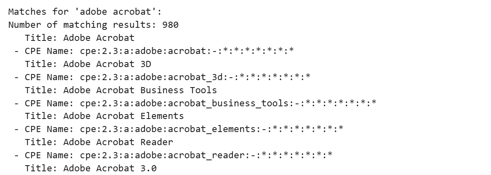
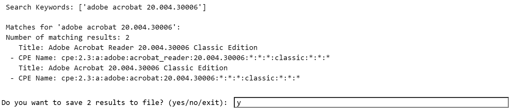
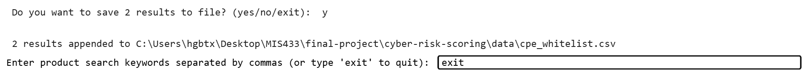

# 1. Introduction

## NIST Cybersecurity Framework (CSF)

***

>>_Cybersecurity risks are expanding constantly, and managing those risks must be a continuous process. This is true regardless of whether an organization is just beginning to confront its cybersecurity challenges or whether it has been active for many years with a sophisticated, well-resourced cybersecurity team._
>>
>>\- _[NIST](https://nvlpubs.nist.gov/nistpubs/CSWP/NIST.CSWP.29.pdf)_

>>_Cybersecurity is the guardian of our digital realm, preserving the confidentiality, integrity and availability of our data. It's the defensive frontline protecting supply chains, physical infrastructure and external networks against unauthorized access and lurking threats.  Organizations that prioritize cyber resilience are better equipped to withstand attacks, minimize operational disruptions, and maintain trust with stakeholders._\
\
\- _[Accenture](https://www.accenture.com/us-en/insights/cyber-security-index)_

Organizations must have a framework for how they deal with both attempted and successful cyberattacks. One well-respected model, the NIST Cybersecurity Framework (CSF), explains how to identify attacks, protect systems, detect and respond to threats, and recover from successful attacks. 

Like NIST's CSF, the intended audience for this application tool include individuals:
>>_responsible for developing and leading cybersecurity programs and/or involved in managing risk — including executives, boards of directors, acquisition professionals, technology professionals, risk managers, lawyers, human resources specialists, and cybersecurity and risk management auditors — to guide their cybersecurity-related decisions._\
\
\- _[National Institute of Standards and Technology (NIST)](https://nvlpubs.nist.gov/nistpubs/CSWP/NIST.CSWP.29.pdf)_

Prioritizing cyber resilency starts with understanding an organization's current cybersecurity risks. This is achieved via the "Identify" function of the CSF and broken down into three (3) main categories:
* __Asset Management__:  "Assets (e.g., data, hardware, software, systems, facilities, services, people) that enable the organization to achieve business purposes are identified and managed consistent with their relative importance to organizational objectives and the organization's risk strategy" ([ID.AM](https://csrc.nist.gov/Projects/Cybersecurity-Framework/Filters#/csf/filters:~:text=Asset%20Management%20(ID.AM)%3A%20Assets%20(e.g.%2C%20data%2C%20hardware%2C%20software%2C%20systems%2C%20facilities%2C%20services%2C%20people)%20that%20enable%20the%20organization%20to%20achieve%20business%20purposes%20are%20identified%20and%20managed%20consistent%20with%20their%20relative%20importance%20to%20organizational%20objectives%20and%20the%20organization%27s%20risk%20strategy))
* __Risk Assessment__: "The cybersecurity risk to the organization, assets, and individuals is understood by the organization" ([ID.RA](https://csrc.nist.gov/Projects/Cybersecurity-Framework/Filters#/csf/filters:~:text=Risk%20Assessment%20(ID.RA)%3A%20The%20cybersecurity%20risk%20to%20the%20organization%2C%20assets%2C%20and%20individuals%20is%20understood%20by%20the%20organization))
* __Improvement__:  "Improvements to organizational cybersecurity risk management processes, procedures and activities are identified across all CSF Functions" ([ID.IM](https://csrc.nist.gov/Projects/Cybersecurity-Framework/Filters#/csf/filters:~:text=Improvement%20(ID.IM)%3A%20Improvements%20to%20organizational%20cybersecurity%20risk%20management%20processes%2C%20procedures%20and%20activities%20are%20identified%20across%20all%20CSF%20Functions))

## Project Objective 
------

#### Prototype a tool that supports _asset management_ and _risk assessment_ within the __Identify__ function of NIST's Cybersecurity Framework.
\
The tool will support _asset management_ by:
* ingesting user-defined common platform enumerations (CPE) using NIST's CPE API to inventory
    * "hardware managed by the organization" ([ID.AM-01](https://csrc.nist.gov/Projects/Cybersecurity-Framework/Filters#/csf/filters:~:text=ID.AM%2D01%3A%20Inventories%20of%20hardware%20managed%20by%20the%20organization%20are%20maintained))
    * "software, services, and systems managed by the organization" by  ([ID.AM-02](https://csrc.nist.gov/Projects/Cybersecurity-Framework/Filters#/csf/filters:~:text=ID.AM%2D02%3A%20Inventories%20of%20software%2C%20services%2C%20and%20systems%20managed%20by%20the%20organization%20are%20maintained))
    * "services provided by suppliers" ([ID.AM-04](https://csrc.nist.gov/Projects/Cybersecurity-Framework/Filters#/csf/filters:~:text=ID.AM%2D04%3A%20Inventories%20of%20services%20provided%20by%20suppliers%20are%20maintained))
* prioritizing assets "based on classification, criticality, resources, and impact on the mission" ([ID.AM-05](https://csrc.nist.gov/Projects/Cybersecurity-Framework/Filters#/csf/filters:~:text=ID.AM%2D05%3A%20Assets%20are%20prioritized%20based%20on%20classification%2C%20criticality%2C%20resources%2C%20and%20impact%20on%20the%20mission))

The tool will support _risk assessment_ by:
* identifying, validating, and recording "vulnerabilities in assets" using NIST's Common Vulnerabilities & Exploitations (CVE) API ([ID.RA-01](https://csrc.nist.gov/Projects/Cybersecurity-Framework/Filters#/csf/filters:~:text=ID.RA%2D01%3A%20Vulnerabilities%20in%20assets%20are%20identified%2C%20validated%2C%20and%20recorded); [ID.RA-02](https://csrc.nist.gov/Projects/Cybersecurity-Framework/Filters#/csf/filters:~:text=ID.RA%2D02%3A%20Cyber%20threat%20intelligence%20is%20received%20from%20information%20sharing%20forums%20and%20sources))
* analyzing vulnerablity risks via: ([ID.RA-04](https://csrc.nist.gov/Projects/Cybersecurity-Framework/Filters#/csf/filters:~:text=ID.RA%2D04%3A%20Potential%20impacts%20and%20likelihoods%20of%20threats%20exploiting%20vulnerabilities%20are%20identified%20and%20recorded); [ID.RA-06](https://csrc.nist.gov/Projects/Cybersecurity-Framework/Filters#/csf/filters:~:text=ID.RA%2D06%3A%20Risk%20responses%20are%20chosen%2C%20prioritized%2C%20planned%2C%20tracked%2C%20and%20communicated); [ID.RA-07](https://csrc.nist.gov/Projects/Cybersecurity-Framework/Filters#/csf/filters:~:text=ID.RA%2D07%3A%20Changes%20and%20exceptions%20are%20managed%2C%20assessed%20for%20risk%20impact%2C%20recorded%2C%20and%20tracked); [ID.RA-08](https://csrc.nist.gov/Projects/Cybersecurity-Framework/Filters#/csf/filters:~:text=ID.RA%2D08%3A%20Processes%20for%20receiving%2C%20analyzing%2C%20and%20responding%20to%20vulnerability%20disclosures%20are%20established); [ID.RA-09](https://csrc.nist.gov/Projects/Cybersecurity-Framework/Filters#/csf/filters:~:text=ID.RA%2D09%3A%20The%20authenticity%20and%20integrity%20of%20hardware%20and%20software%20are%20assessed%20prior%20to%20acquisition%20and%20use)):
    * mapping CVE severity scores for user defined CPEs
    * computing a composite risk score per asset/business unit
* uses an AI assistant to ([ID.RA-04](https://csrc.nist.gov/Projects/Cybersecurity-Framework/Filters#/csf/filters:~:text=ID.RA%2D04%3A%20Potential%20impacts%20and%20likelihoods%20of%20threats%20exploiting%20vulnerabilities%20are%20identified%20and%20recorded); [ID.RA-06](https://csrc.nist.gov/Projects/Cybersecurity-Framework/Filters#/csf/filters:~:text=ID.RA%2D06%3A%20Risk%20responses%20are%20chosen%2C%20prioritized%2C%20planned%2C%20tracked%2C%20and%20communicated); [ID.RA-07](https://csrc.nist.gov/Projects/Cybersecurity-Framework/Filters#/csf/filters:~:text=ID.RA%2D07%3A%20Changes%20and%20exceptions%20are%20managed%2C%20assessed%20for%20risk%20impact%2C%20recorded%2C%20and%20tracked); [ID.RA-08](https://csrc.nist.gov/Projects/Cybersecurity-Framework/Filters#/csf/filters:~:text=ID.RA%2D08%3A%20Processes%20for%20receiving%2C%20analyzing%2C%20and%20responding%20to%20vulnerability%20disclosures%20are%20established); [ID.RA-09](https://csrc.nist.gov/Projects/Cybersecurity-Framework/Filters#/csf/filters:~:text=ID.RA%2D09%3A%20The%20authenticity%20and%20integrity%20of%20hardware%20and%20software%20are%20assessed%20prior%20to%20acquisition%20and%20use)):
    * summarize highest-risk vulnerablities
    * generate mitigation roadmap

## Data Description

The core dataset driving this application is user-defined. Each user ingests CPEs using F1 (Asset Inventory Module) of the tool to generate personalized datasets. In other words, the application itself generates the dataset at runtime rather than relying on a fixed third-party file. This bakes in versatility as a core component.

#### Why This Approach
* __Tailored Relevance__: Users see only vulnerabilities that apply to their stack—no noise from unrelated products.
* __Privacy__: Because the whitelist is entered directly into the app and never leaves the tenancy, no proprietary system details are exposed to third parties.

## Key Features of the Application Tool
***
Feature ID | Module Name | Key Component(s) | What it does |
|--------- |------------ |----------------- |------------- |
| F1 | __Asset Inventory__ | CPE API, Save to File, User Input Required | • Prompts end-user to keyword search an asset (e.g. software, operating system component, hardware) • Returns a list of CPEs (includes partial matches) • Prompts user to save/append list to CSV file • Returns to keyword search prompt • User types 'exit' to terminate search |
| F2 | __Vulnerabilities Identification__ | CVE API, Save to File, User Input Required | • Loads CSV file generated in F1 • Returns a list of CVEs • Prompts user to save/append to file |
| F3 | __Risk Evaluation__ | Risk Scoring Module, Performs Risk Calculation, Appends to File | • Loads file generated in F1 • computing a composite risk score per asset/business unit • Adds/appends risk score columns to file  • maps CVE severity scores for user defined assets |
| F4 | __Mitigation Recommendations__ | OpenAI API, 4o mini GPT, generates recommendations | Given the top-N CVEs for an asset: • produce plain-English impact summaries and step-by-step mitigation roadmaps. |

# F1. Asset Inventory: CPE Ingestion Module Scrnshts

Using "__adobe__" as the example for ingesting CPEs:

1. Upon initiating code, the end user is met with a prompt

2. While the program is searching the CPE API, the user's screen should look like this

3. As you can see, there are thousands of results for the vendor, "adobe"

4. The program will prommpt the user with a yes/no/exit scenario before saving the results
    * In the example, we choose no so we can return to search and refine the results 

5. To refine the search, it is recommended users add product name keyword after vendor in the search bar

6. In this example, vendor and product name still yield too many results

7. At this point, adding the product version is sufficient for narrowing down results appropriately
    * This does not always narrow results down to the exact product needing to be inventoried
        * Application flaw to be remedied in future iterations
            * Integrate a user input prompt that allows users to choose which CPEs to save from a results list
            * results list will likely need to be n-CPEs or less to perform well without more advanced GUI features
        * Alternatively, users can choose to further refine search using additional parameters

8. The refined results best accurately reflect the asset to be inventoried and can now be saved to file:

9. The application will return the file path the data was saved to and loop back to the keyword search bar
    * Users can choose to continue searching or type 'exit' to terminate the search

# Still Needed
* code for features 2 through 4
* Summary of analysis results, including charts and insights
* Architecture or workflow diagram to show integration

5. Summary
    * Project goals, results, & value recap
    * Key lessons learned

Documentation, code, data, and images for this project can be found on my github repository:  [hgbtx/cyber-risk-scoring](https://github.com/hgbtx/cyber-risk-scoring/blob/main)
