##### Check out the streamlit webapps for this project at:
* [CPE/CVE Retrieval Tool](https://cpe-cve-retrieval.streamlit.app/)
* [Risk Scoring Dashboard](https://f3-risk-scoring.streamlit.app/)

_IMPORTANT NOTE(s)_
* _There is no official documentation at this time of the above streamlit webapps_
* _Many of the known issues identified in ``project-details-v2.md`` (nested in the self-named folder) were easily resolved after refactoring/porting the original code to work with streamlit._
* _To use the CPE/CVE retrieval tool, an NVD API key is required._
    * _These keys are free and can be obtained at: [NVD - API Key Request](https://nvd.nist.gov/developers/request-an-api-key)_
* _Future iterations of the webapps will include:_
   * _combining both webapps into one (1) multipage streamlit app_
   * _the addition of two (2) buttons at the bottom of the the dashboard that generates a(n):_
      * _top five (5) asset risks report with mitigation tips_
      * _quarter-over-quarter risk trends analysis report for the top three (3) riskiest assets_
      * _powered by the openai api_

# __1. Introduction__


## NIST Cybersecurity Framework (CSF)

***

>>_Cybersecurity risks are expanding constantly, and managing those risks must be a continuous process. This is true regardless of whether an organization is just beginning to confront its cybersecurity challenges or whether it has been active for many years with a sophisticated, well-resourced cybersecurity team._
>>
>>\- _[NIST](https://nvlpubs.nist.gov/nistpubs/CSWP/NIST.CSWP.29.pdf)_

>>_Cybersecurity is the guardian of our digital realm, preserving the confidentiality, integrity and availability of our data. It's the defensive frontline protecting supply chains, physical infrastructure and external networks against unauthorized access and lurking threats.  Organizations that prioritize cyber resilience are better equipped to withstand attacks, minimize operational disruptions, and maintain trust with stakeholders._\
\
\- _[Accenture](https://www.accenture.com/us-en/insights/cyber-security-index)_

Organizations must have a framework for how they deal with both attempted and successful cyberattacks. One well-respected model, the NIST Cybersecurity Framework (CSF), explains how to identify attacks, protect systems, detect and respond to threats, and recover from successful attacks. 

Like NIST's CSF, the intended audience for this application tool include individuals:
>>_responsible for developing and leading cybersecurity programs and/or involved in managing risk — including executives, boards of directors, acquisition professionals, technology professionals, risk managers, lawyers, human resources specialists, and cybersecurity and risk management auditors — to guide their cybersecurity-related decisions._\
\
\- _[National Institute of Standards and Technology (NIST)](https://nvlpubs.nist.gov/nistpubs/CSWP/NIST.CSWP.29.pdf)_

Prioritizing cyber resilency starts with understanding an organization's current cybersecurity risks. This is achieved via the "Identify" function of the CSF and broken down into three (3) main categories:
* __Asset Management__:  "Assets (e.g., data, hardware, software, systems, facilities, services, people) that enable the organization to achieve business purposes are identified and managed consistent with their relative importance to organizational objectives and the organization's risk strategy" ([ID.AM](https://csrc.nist.gov/Projects/Cybersecurity-Framework/Filters#/csf/filters:~:text=Asset%20Management%20(ID.AM)%3A%20Assets%20(e.g.%2C%20data%2C%20hardware%2C%20software%2C%20systems%2C%20facilities%2C%20services%2C%20people)%20that%20enable%20the%20organization%20to%20achieve%20business%20purposes%20are%20identified%20and%20managed%20consistent%20with%20their%20relative%20importance%20to%20organizational%20objectives%20and%20the%20organization%27s%20risk%20strategy))
* __Risk Assessment__: "The cybersecurity risk to the organization, assets, and individuals is understood by the organization" ([ID.RA](https://csrc.nist.gov/Projects/Cybersecurity-Framework/Filters#/csf/filters:~:text=Risk%20Assessment%20(ID.RA)%3A%20The%20cybersecurity%20risk%20to%20the%20organization%2C%20assets%2C%20and%20individuals%20is%20understood%20by%20the%20organization))
* __Improvement__:  "Improvements to organizational cybersecurity risk management processes, procedures and activities are identified across all CSF Functions" ([ID.IM](https://csrc.nist.gov/Projects/Cybersecurity-Framework/Filters#/csf/filters:~:text=Improvement%20(ID.IM)%3A%20Improvements%20to%20organizational%20cybersecurity%20risk%20management%20processes%2C%20procedures%20and%20activities%20are%20identified%20across%20all%20CSF%20Functions))

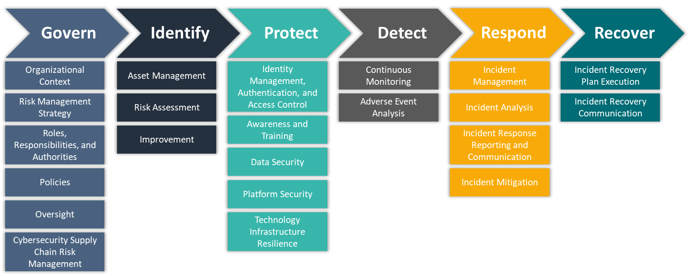

## Project Objective 
------

#### Prototype a tool that supports _asset management_ and _risk assessment_ within the __Identify__ function of NIST's Cybersecurity Framework.
\
The tool will support _asset management_ by:
* ingesting user-defined common platform enumerations (CPE) using NIST's CPE API to inventory
    * "hardware managed by the organization" ([ID.AM-01](https://csrc.nist.gov/Projects/Cybersecurity-Framework/Filters#/csf/filters:~:text=ID.AM%2D01%3A%20Inventories%20of%20hardware%20managed%20by%20the%20organization%20are%20maintained))
    * "software, services, and systems managed by the organization" by  ([ID.AM-02](https://csrc.nist.gov/Projects/Cybersecurity-Framework/Filters#/csf/filters:~:text=ID.AM%2D02%3A%20Inventories%20of%20software%2C%20services%2C%20and%20systems%20managed%20by%20the%20organization%20are%20maintained))
    * "services provided by suppliers" ([ID.AM-04](https://csrc.nist.gov/Projects/Cybersecurity-Framework/Filters#/csf/filters:~:text=ID.AM%2D04%3A%20Inventories%20of%20services%20provided%20by%20suppliers%20are%20maintained))
* prioritizing assets "based on classification, criticality, resources, and impact on the mission" ([ID.AM-05](https://csrc.nist.gov/Projects/Cybersecurity-Framework/Filters#/csf/filters:~:text=ID.AM%2D05%3A%20Assets%20are%20prioritized%20based%20on%20classification%2C%20criticality%2C%20resources%2C%20and%20impact%20on%20the%20mission))

The tool will support _risk assessment_ by:
* identifying, validating, and recording "vulnerabilities in assets" using NIST's Common Vulnerabilities & Exploitations (CVE) API ([ID.RA-01](https://csrc.nist.gov/Projects/Cybersecurity-Framework/Filters#/csf/filters:~:text=ID.RA%2D01%3A%20Vulnerabilities%20in%20assets%20are%20identified%2C%20validated%2C%20and%20recorded); [ID.RA-02](https://csrc.nist.gov/Projects/Cybersecurity-Framework/Filters#/csf/filters:~:text=ID.RA%2D02%3A%20Cyber%20threat%20intelligence%20is%20received%20from%20information%20sharing%20forums%20and%20sources))
* analyzing vulnerablity risks via: ([ID.RA-04](https://csrc.nist.gov/Projects/Cybersecurity-Framework/Filters#/csf/filters:~:text=ID.RA%2D04%3A%20Potential%20impacts%20and%20likelihoods%20of%20threats%20exploiting%20vulnerabilities%20are%20identified%20and%20recorded); [ID.RA-06](https://csrc.nist.gov/Projects/Cybersecurity-Framework/Filters#/csf/filters:~:text=ID.RA%2D06%3A%20Risk%20responses%20are%20chosen%2C%20prioritized%2C%20planned%2C%20tracked%2C%20and%20communicated); [ID.RA-07](https://csrc.nist.gov/Projects/Cybersecurity-Framework/Filters#/csf/filters:~:text=ID.RA%2D07%3A%20Changes%20and%20exceptions%20are%20managed%2C%20assessed%20for%20risk%20impact%2C%20recorded%2C%20and%20tracked); [ID.RA-08](https://csrc.nist.gov/Projects/Cybersecurity-Framework/Filters#/csf/filters:~:text=ID.RA%2D08%3A%20Processes%20for%20receiving%2C%20analyzing%2C%20and%20responding%20to%20vulnerability%20disclosures%20are%20established); [ID.RA-09](https://csrc.nist.gov/Projects/Cybersecurity-Framework/Filters#/csf/filters:~:text=ID.RA%2D09%3A%20The%20authenticity%20and%20integrity%20of%20hardware%20and%20software%20are%20assessed%20prior%20to%20acquisition%20and%20use)):
    * mapping CVE severity scores for user defined CPEs
    * computing a composite risk score per asset/business unit
* uses an AI assistant to ([ID.RA-04](https://csrc.nist.gov/Projects/Cybersecurity-Framework/Filters#/csf/filters:~:text=ID.RA%2D04%3A%20Potential%20impacts%20and%20likelihoods%20of%20threats%20exploiting%20vulnerabilities%20are%20identified%20and%20recorded); [ID.RA-06](https://csrc.nist.gov/Projects/Cybersecurity-Framework/Filters#/csf/filters:~:text=ID.RA%2D06%3A%20Risk%20responses%20are%20chosen%2C%20prioritized%2C%20planned%2C%20tracked%2C%20and%20communicated); [ID.RA-07](https://csrc.nist.gov/Projects/Cybersecurity-Framework/Filters#/csf/filters:~:text=ID.RA%2D07%3A%20Changes%20and%20exceptions%20are%20managed%2C%20assessed%20for%20risk%20impact%2C%20recorded%2C%20and%20tracked); [ID.RA-08](https://csrc.nist.gov/Projects/Cybersecurity-Framework/Filters#/csf/filters:~:text=ID.RA%2D08%3A%20Processes%20for%20receiving%2C%20analyzing%2C%20and%20responding%20to%20vulnerability%20disclosures%20are%20established); [ID.RA-09](https://csrc.nist.gov/Projects/Cybersecurity-Framework/Filters#/csf/filters:~:text=ID.RA%2D09%3A%20The%20authenticity%20and%20integrity%20of%20hardware%20and%20software%20are%20assessed%20prior%20to%20acquisition%20and%20use)):
    * summarize highest-risk vulnerablities
    * generate mitigation roadmap

## Data Description

The core dataset driving this application is user-defined. Each user ingests CPEs using F1 (Asset Inventory Module) of the tool to generate personalized datasets. In other words, the application itself generates the dataset at runtime rather than relying on a fixed third-party file. This bakes in versatility as a core component.

#### Why This Approach
* __Tailored Relevance__: Users see only vulnerabilities that apply to their stack—no noise from unrelated products.
* __Privacy__: Because the whitelist is entered directly into the app and never leaves the tenancy, no proprietary system details are exposed to third parties.

## Key Features of the Application Tool
***
Feature ID | Module Name | Key Component(s) | What it does |
|--------- |------------ |----------------- |------------- |
| F1 | __Asset Inventory__ | CPE API, Save to File, User Input Required | • Prompts end-user to keyword search an asset (e.g. software, operating system component, hardware)<br>• Returns a list of CPEs (includes partial matches)<br>• Prompts user to save/append list to CSV file<br>• Returns to keyword search prompt<br>• User types 'exit' to terminate search |
| F2 | __Vulnerabilities Identification__ | CVE API, Save to File, User Input Required | • Loads CSV file generated in F1<br>• Returns a list of CVEs<br>• Prompts user to save/append to file |
| F3 | __Risk Evaluation__ | Risk Scoring Module, Performs Risk Calculation, Appends to File | • Loads file generated in F1<br>• computing a composite risk score per asset/business unit<br>• Adds/appends risk score columns to file <br>• maps CVE severity scores for user defined assets |
| F4 | __Mitigation Recommendations__ | OpenAI API, 4o mini GPT, generates recommendations | Given the top-N CVEs for an asset:<br>• produce plain-English impact summaries and step-by-step mitigation roadmaps. |

The following datasets will be used for the purposes of demonstrating the application tool features:


```python
import pandas as pd

assets = pd.read_csv('../data/cpe_whitelist.csv')
assets
```


<div>
<style scoped>
    .dataframe tbody tr th:only-of-type {
        vertical-align: middle;
    }

    .dataframe tbody tr th {
        vertical-align: top;
    }

    .dataframe thead th {
        text-align: right;
    }
</style>
<table border="1" class="dataframe">
  <thead>
    <tr style="text-align: right;">
      <th></th>
      <th>WrittenAt</th>
      <th>Title</th>
      <th>cpeName</th>
    </tr>
  </thead>
  <tbody>
    <tr>
      <th>0</th>
      <td>2025-06-08T18:58:54.485</td>
      <td>Tableau Desktop 2021.1</td>
      <td>cpe:2.3:a:tableau:tableau_desktop:2021.1:*:*:*...</td>
    </tr>
    <tr>
      <th>1</th>
      <td>2025-06-08T18:59:05.725</td>
      <td>Adobe Acrobat Reader 20.004.30006 Classic Edition</td>
      <td>cpe:2.3:a:adobe:acrobat_reader:20.004.30006:*:...</td>
    </tr>
    <tr>
      <th>2</th>
      <td>2025-06-08T18:59:17.606</td>
      <td>Oracle SuiteCommerce Advanced</td>
      <td>cpe:2.3:a:oracle:suitecommerce_advanced:-:*:*:...</td>
    </tr>
    <tr>
      <th>3</th>
      <td>2025-06-08T18:59:17.606</td>
      <td>Oracle SuiteCommerce Advanced 2020.1.4</td>
      <td>cpe:2.3:a:oracle:suitecommerce_advanced:2020.1...</td>
    </tr>
    <tr>
      <th>4</th>
      <td>2025-06-08T18:59:27.454</td>
      <td>Alteryx Server 2022.1.1.42590</td>
      <td>cpe:2.3:a:alteryx:alteryx_server:2022.1.1.4259...</td>
    </tr>
    <tr>
      <th>5</th>
      <td>2025-06-08T21:55:41.178</td>
      <td>Fortinet FortiGate 7000</td>
      <td>cpe:2.3:h:fortinet:fortigate_7000:-:*:*:*:*:*:*:*</td>
    </tr>
    <tr>
      <th>6</th>
      <td>2025-06-08T22:01:52.494</td>
      <td>Workday 31.2</td>
      <td>cpe:2.3:a:workday:workday:31.2:*:*:*:*:*:*:*</td>
    </tr>
    <tr>
      <th>7</th>
      <td>2025-06-08T22:04:13.394</td>
      <td>Alfresco Enterprise 4.1.6.13</td>
      <td>cpe:2.3:a:alfresco:alfresco:4.1.6.13:*:*:*:ent...</td>
    </tr>
    <tr>
      <th>8</th>
      <td>2025-06-08T22:06:35.432</td>
      <td>Oracle Database 19c Enterprise Edition</td>
      <td>cpe:2.3:a:oracle:database:19c:*:*:*:enterprise...</td>
    </tr>
    <tr>
      <th>9</th>
      <td>2025-06-08T22:06:53.654</td>
      <td>Oracle Database Vault 19c</td>
      <td>cpe:2.3:a:oracle:database_vault:19c:*:*:*:*:*:*:*</td>
    </tr>
    <tr>
      <th>10</th>
      <td>2025-06-08T22:07:10.617</td>
      <td>Oracle Database Server 19c</td>
      <td>cpe:2.3:a:oracle:database_server:19c:*:*:*:*:*...</td>
    </tr>
    <tr>
      <th>11</th>
      <td>2025-06-08T22:07:33.052</td>
      <td>Oracle Database Recovery Manager 19c</td>
      <td>cpe:2.3:a:oracle:database_recovery_manager:19c...</td>
    </tr>
    <tr>
      <th>12</th>
      <td>2025-06-08T22:12:59.597</td>
      <td>Microsoft Exchange Server 2019</td>
      <td>cpe:2.3:a:microsoft:exchange_server:2019:-:*:*...</td>
    </tr>
    <tr>
      <th>13</th>
      <td>2025-06-08T22:12:59.597</td>
      <td>Microsoft Exchange Server 2019 Cumulative Upda...</td>
      <td>cpe:2.3:a:microsoft:exchange_server:2019:cumul...</td>
    </tr>
  </tbody>
</table>
</div>


```python
vulnerabilities = pd.read_csv('../data/vuln_catalogue_v1.csv')
print("Total rows:", len(vulnerabilities))
vulnerabilities[['cveID','published', 'baseScore', 'baseSeverity', 'description', 'full_json']]
```

    Total rows: 442
    


<div>
<style scoped>
    .dataframe tbody tr th:only-of-type {
        vertical-align: middle;
    }

    .dataframe tbody tr th {
        vertical-align: top;
    }

    .dataframe thead th {
        text-align: right;
    }
</style>
<table border="1" class="dataframe">
  <thead>
    <tr style="text-align: right;">
      <th></th>
      <th>cveID</th>
      <th>published</th>
      <th>baseScore</th>
      <th>baseSeverity</th>
      <th>description</th>
      <th>full_json</th>
    </tr>
  </thead>
  <tbody>
    <tr>
      <th>0</th>
      <td>NaN</td>
      <td>NaN</td>
      <td>NaN</td>
      <td>NaN</td>
      <td>NO CVEs FOUND FOR THIS ASSET</td>
      <td>NaN</td>
    </tr>
    <tr>
      <th>1</th>
      <td>CVE-2021-39836</td>
      <td>2021-09-29T16:15:08.513</td>
      <td>7.8</td>
      <td>HIGH</td>
      <td>Acrobat Reader DC versions 2021.005.20060 (and...</td>
      <td>{'cve': {'id': 'CVE-2021-39836', 'sourceIdenti...</td>
    </tr>
    <tr>
      <th>2</th>
      <td>CVE-2021-39837</td>
      <td>2021-09-29T16:15:08.573</td>
      <td>7.8</td>
      <td>HIGH</td>
      <td>Acrobat Reader DC versions 2021.005.20060 (and...</td>
      <td>{'cve': {'id': 'CVE-2021-39837', 'sourceIdenti...</td>
    </tr>
    <tr>
      <th>3</th>
      <td>CVE-2021-39838</td>
      <td>2021-09-29T16:15:08.633</td>
      <td>7.8</td>
      <td>HIGH</td>
      <td>Acrobat Reader DC versions 2021.005.20060 (and...</td>
      <td>{'cve': {'id': 'CVE-2021-39838', 'sourceIdenti...</td>
    </tr>
    <tr>
      <th>4</th>
      <td>CVE-2021-39839</td>
      <td>2021-09-29T16:15:08.693</td>
      <td>7.8</td>
      <td>HIGH</td>
      <td>Acrobat Reader DC versions 2021.005.20060 (and...</td>
      <td>{'cve': {'id': 'CVE-2021-39839', 'sourceIdenti...</td>
    </tr>
    <tr>
      <th>...</th>
      <td>...</td>
      <td>...</td>
      <td>...</td>
      <td>...</td>
      <td>...</td>
      <td>...</td>
    </tr>
    <tr>
      <th>437</th>
      <td>CVE-1999-1322</td>
      <td>1998-11-12T05:00:00.000</td>
      <td>NaN</td>
      <td>NaN</td>
      <td>The installation of 1ArcServe Backup and Inocu...</td>
      <td>{'cve': {'id': 'CVE-1999-1322', 'sourceIdentif...</td>
    </tr>
    <tr>
      <th>438</th>
      <td>CVE-2000-0216</td>
      <td>2000-02-29T05:00:00.000</td>
      <td>NaN</td>
      <td>NaN</td>
      <td>Microsoft email clients in Outlook, Exchange, ...</td>
      <td>{'cve': {'id': 'CVE-2000-0216', 'sourceIdentif...</td>
    </tr>
    <tr>
      <th>439</th>
      <td>CVE-2011-0290</td>
      <td>2011-10-21T10:55:03.757</td>
      <td>NaN</td>
      <td>NaN</td>
      <td>The BlackBerry Collaboration Service in Resear...</td>
      <td>{'cve': {'id': 'CVE-2011-0290', 'sourceIdentif...</td>
    </tr>
    <tr>
      <th>440</th>
      <td>CVE-2012-2284</td>
      <td>2012-10-18T17:55:01.613</td>
      <td>NaN</td>
      <td>NaN</td>
      <td>The (1) install and (2) upgrade processes in E...</td>
      <td>{'cve': {'id': 'CVE-2012-2284', 'sourceIdentif...</td>
    </tr>
    <tr>
      <th>441</th>
      <td>CVE-2024-21410</td>
      <td>2024-02-13T18:15:59.680</td>
      <td>9.8</td>
      <td>CRITICAL</td>
      <td>Microsoft Exchange Server Elevation of Privile...</td>
      <td>{'cve': {'id': 'CVE-2024-21410', 'sourceIdenti...</td>
    </tr>
  </tbody>
</table>
<p>442 rows × 6 columns</p>
</div>


# __F1. Asset Inventory__

Before CVEs can be ingested and processed for risk scoring, ``cpe_name``s must be identified and ingested as this is a required parameter when using the NVD CVE API. When no ``cpe_name`` is defined in the NVD CVE API call, all ``cpe_names`` are returned. 

## Scope Management

For the purposes of managing the scope of this application tool: 

* It is important to note that each CPE is likely to have multiple CVEs.
* In some cases, a CPE can have hundreds (100's) of CVEs
    * especially if the CPE is associated with a well-established product (e.g. Windows products)
* When saving CPEs to the ``cpe_whitelist.csv``, only save the CPEs necessary for inventorying assets
    * improves overall application performance
    * prevents system errors/disruptions
 
## Keyword Search Tips

Because this search engine is __not__ an exact keyword search, it is recommended that users:
* start with vendor name only (e.g. Adobe)
* refine search by adding product keyword (e.g. Acrobat)
* further refine search by adding version number (e.g. 20.004.30006)

## Intended Purpose of Code

The below code was generated by AI to create a simple to use tool that interacts with the NVD CPE API.

Key features:
* User input to keyword search the CPE API
* Machine outputs results
* Prompts user with a yes/no/exit scenario before saving results to file
* Saves search results to ``cpe_whitelist.csv``
    * Does not overwrite previous outputs to file
    * Appends new outputs to existing outputs in file
* Undo write to file option
    * user types 'undo' in the prompt
    * removes most recent record written to file
        * can be called repeatedly until no records written to file remain
    * logs unwritten records in ``cpe_undo_log.csv``

## Known Issues

* There is no option to remove files out of this sequence.
    * _For example, users cannot choose to unwrite a record in row 6 without unwriting every row after row 6 as well._
* Search results cannot always be refined down to just one (1) ``cpe_name`` in scenarios where there are many ``cpe_name``s and the user wants to save a ``cpe_name`` with the broadest features.
    * For example:
        * a user key word searches 'Microsoft Exchange Server 2019'
            * the CPE API returns 15 matches that includes
                *    Title: Microsoft Exchange Server 2019\
                     \- CPE Name: cpe:2.3:a:microsoft:exchange_server:2019:-:\*:\*:\*:\*:\*:*
            * all 14 cumulative updates of Microsoft Exchange Server 2019
                *    Title: Microsoft Exchange Server 2019 Cumulative Update \[1-14]\
                     \- CPE Name: cpe:2.3:a:microsoft:exchange_server:2019:cumulative_update_\[1-14]:\*:\*:\*:\*:\*:*\
                     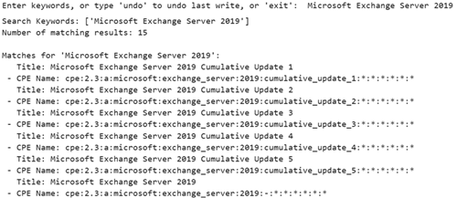

# __F1. Asset Inventory Screenshots__

### Using "__adobe__" as the example for ingesting CPEs:
***


##### 1. Upon initiating code, the end user is met with a prompt
\
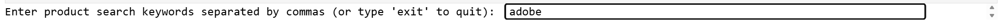
***

##### 2. While the program is searching the CPE API, the user's screen should look like this
\

***

##### 3. As you can see, there are thousands of results for the vendor, "adobe"
\
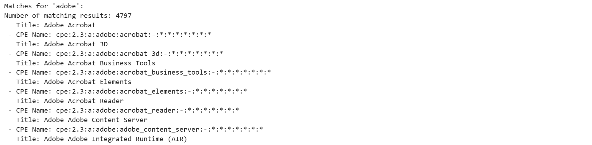
***

##### 4. The program will prommpt the user with a yes/no/exit scenario before saving the results
\
    * In the example, we choose no so we can return to search and refine the results 


***

##### 5. To refine the search, it is recommended users add product name keyword after vendor in the search bar
\
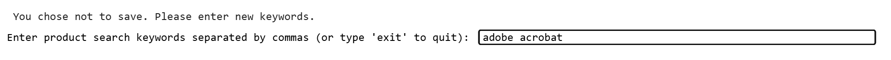
***

##### 6. In this example, vendor and product name still yield too many results
\

***

##### 7. At this point, adding the product version is sufficient for narrowing down results appropriately
* This does not always narrow results down to the exact product needing to be inventoried
  * Application flaw to be remedied in future iterations
    * Integrate a user input prompt that allows users to choose which CPEs to save from a results list
      * Results list will likely need to be n-CPEs or less to perform well without more advanced GUI features
\
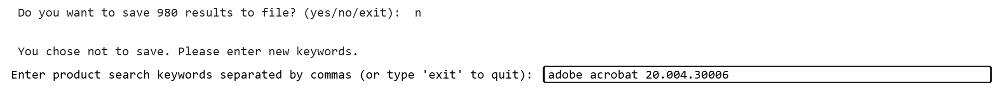
***

##### 8. The refined results best accurately reflect the asset to be inventoried and can now be saved to file:
\

***

##### 9. The application will return the file path the data was saved to and loop back to the keyword search bar
* Users can choose to continue searching or type 'exit' to terminate the search
\


# __F2. Identifying Vulnerabilities__

Once the ``cpe_whitelist.csv`` has been compiled, the CVE API can be called to ingest CVEs relating to the user-defined CPEs.

## Intended Purpose of Code

The below code was generated by AI and modified by the developer to create a simple to use tool that interacts with the NVD CVE API.

### Key features:

* Loads ``cpe_whitelist.csv`` generated in __F1. Asset Inventory__
    * Either loads to a dataframe or saves to a new file for ingested CVE data to be appended to
        * Regardless of loading to dataframe or saving to new file, ingested CVE data will need to be joined to corresponding CPE
            * Due to this, duplicate CVEs are to be expected and necessary for risk scoring granularity
* Ingests CVEs according to CPEs recorded in ``cpe_whitlelist.csv``
    * Columns for CVE data should reflect types of information discussed in the __Information returned__ section above
* Joins CVE data to corresponding CPEs
    * A surrogate key is generated for the joined dataset
    * A new row will be created for each CVE that corresponds to one (1) CPE

To handle cases where a CPE from the whitelist has no associated CVEs, a record must be generated that explicitly inserts a row for every CPE that returns no CVEs. This allows users to:
* Track all inventoried assets, even those with zero known vulnerabilities.
* Preserve one-to-one continuity between asset inventory (whitelist) and vulnerability table.
* Avoid accidental data loss or gaps in your final reports.

## Known Issues

* ``exploitabilityScore`` and ``impactScore`` do not return in the columns output when CVE–CPE rows are collected
* In the data processing cells to retrieve the missing ``exploitabilityScore`` and ``impactScore``:
    * the ``DataFrame`` generated in the API retrieval must first be saved and reloaded
        * for some reason the code is unsuccessful at pulling out these scores (all values return as 'None')
        * but does successfully return scores when the data is loaded from a csv file

# __F2. Vulnerabilities Identification Screenshots__

##### 1. 
\
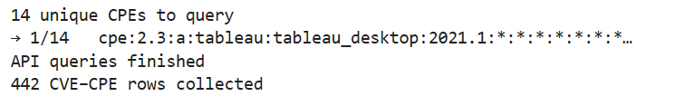
***

##### 2. 
\
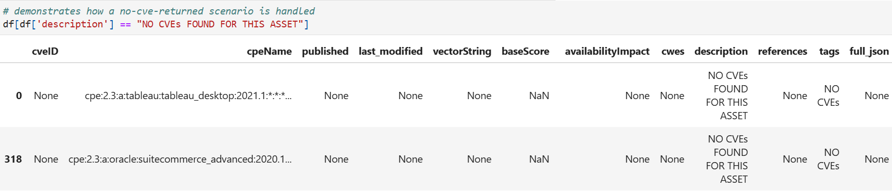
***

##### 3. 
\
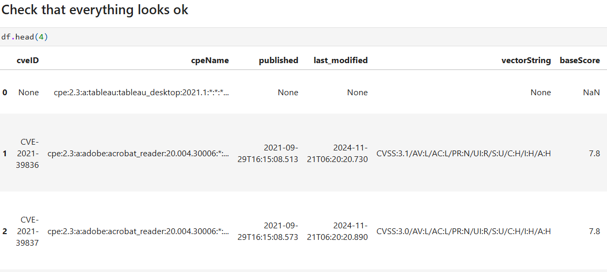
***

##### 4. 
\
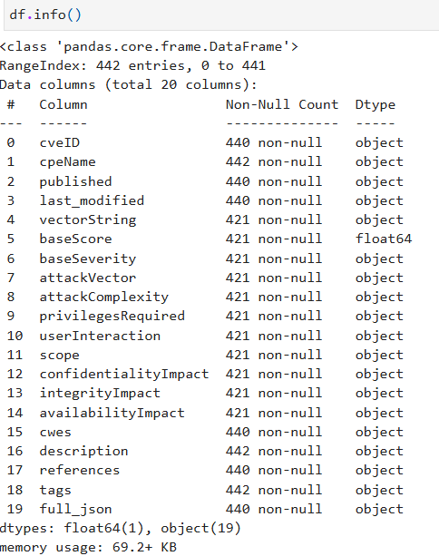
***

##### 5. 
\
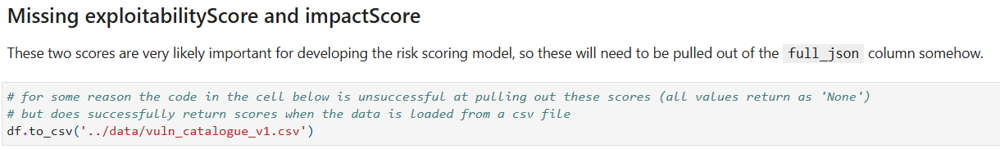
***

##### 6. 
\
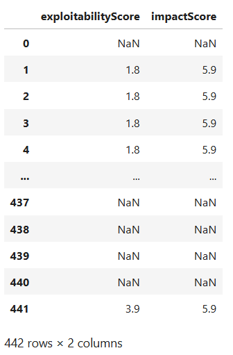
***

##### 7. 
\
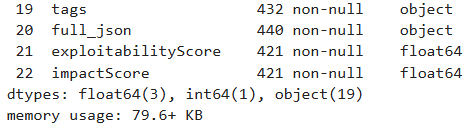
##### 8. 
\
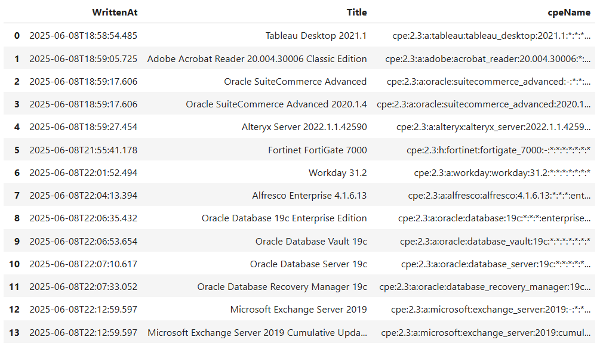
***

# __F3. Risk Scoring__

>>_The CSF’s use will vary based on an organization’s unique mission and risks. With an understanding of stakeholder expectations and risk appetite and tolerance (as outlined in GOVERN), an organization can prioritize cybersecurity activities to make informed decisions about cybersecurity expenditures and actions. An organization may choose to handle risk in one or more ways — including mitigating, transferring, avoiding, or accepting negative risks and realizing, sharing, enhancing, or accepting positive risks — depending on the potential impacts and likelihoods. Importantly, an organization can use the CSF both internally to manage its cybersecurity capabilities and externally to oversee or communicate with third parties._\
\
\- _[National Institute of Standards and Technology (NIST)](https://nvlpubs.nist.gov/nistpubs/CSWP/NIST.CSWP.29.pdf)_


```python
import pandas as pd
philosophy = pd.read_csv('../data/risk_philosophy.csv')
philosophy
```


<div>
<style scoped>
    .dataframe tbody tr th:only-of-type {
        vertical-align: middle;
    }

    .dataframe tbody tr th {
        vertical-align: top;
    }

    .dataframe thead th {
        text-align: right;
    }
</style>
<table border="1" class="dataframe">
  <thead>
    <tr style="text-align: right;">
      <th></th>
      <th>Risk Philosophy</th>
      <th>Scoring Formula(s)</th>
      <th>Aggregation(s)</th>
      <th>When to Use</th>
    </tr>
  </thead>
  <tbody>
    <tr>
      <th>0</th>
      <td>Conservative</td>
      <td>Multiplicative</td>
      <td>Max</td>
      <td>To only act on high-confidence, multi-dimensio...</td>
    </tr>
    <tr>
      <th>1</th>
      <td>Worst-case</td>
      <td>Worst Case (Max)</td>
      <td>Max</td>
      <td>To flag any asset with a single severe vulnera...</td>
    </tr>
    <tr>
      <th>2</th>
      <td>Balanced/Pragmatic</td>
      <td>Weighted Average, Simple Mean</td>
      <td>Mean, Median</td>
      <td>For realistic, overall asset risk monitoring</td>
    </tr>
    <tr>
      <th>3</th>
      <td>Cumulative</td>
      <td>Simple Mean, Weighted Average</td>
      <td>Sum</td>
      <td>When interested in total risk exposure per asset</td>
    </tr>
    <tr>
      <th>4</th>
      <td>Outlier-resistant</td>
      <td>Simple Mean, Weighted Average</td>
      <td>Median</td>
      <td>To ignore rare extremes and focus on typical r...</td>
    </tr>
  </tbody>
</table>
</div>


## Intended Purpose of Code

The risk scoring module was designed with an interactive dashboard that generates personalized risk scoring and summarizes findings using tables and graphs to account for individual user needs. Some of the graphs are generated using data not involved in calculating risk scores and don't update with new user input. These graphs are 'static' and supplement findings in the risk score analysis.

### __Key Features__

#### Risk-Scoring
* Interactive risk scoring module with user input/dropdown/slider for:
    * Risk Formula
        * Supports multiple risk formulas (weighted, multiplicative, worst-case, mean)
    * Aggregation Method
        * Aggregates by (max, mean, median, sum, count high-risk CVEs)
    * Floating Slider
        * Allows users to toggle CVE count thresholds per asset

#### Analysis & Visualization
* Generates the following in response to user inputs in the interactive risk scoring module:
    * Summary Tables
        * Asset-level Risk Summary
        * CVE-level Vulnerabilities Summary
    * Heatmap
        * asset vs riskScore
    * Time Series:
        * monthly count of new CVEs per asset
            * Future Enhancement: multiple choice legend allowing users to filter any combination of assets
 

#### Static Visualizations
* Pie Chart
    * distribution of severity levels (Critical/High/Medium/Low)

### Known Issues

* Save buttons overwrite existing files instead of saving a unique file
    * Appending a version number to the end of the file with each click could resolve this
* No way to sort summary tables
    * _Needs more thought..._

\
\
_The interactive components of the __F3. Risk Scoring__ code were AI generated to tailor analysis to individual user needs._

# __F3. Risk Scoring Screenshots__

##### 1. Users can choose different risk formulas and aggregation methods, as well as adjust the slider to account for risk tolerance thresholds
\
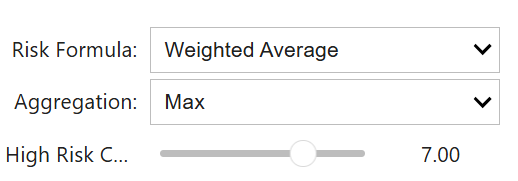
***
##### 2. Provides users an asset-level summary of risk
\
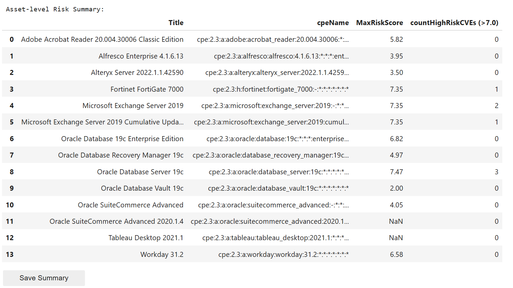
***
##### 3. Provides users with a summary view of vulnerabilities
\
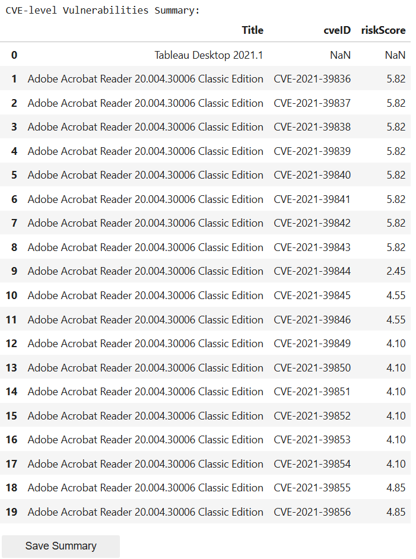
***
##### 4. Pie chart is a static graph showing users the distribution spread of known vulnerabilities of a given set of assets
\
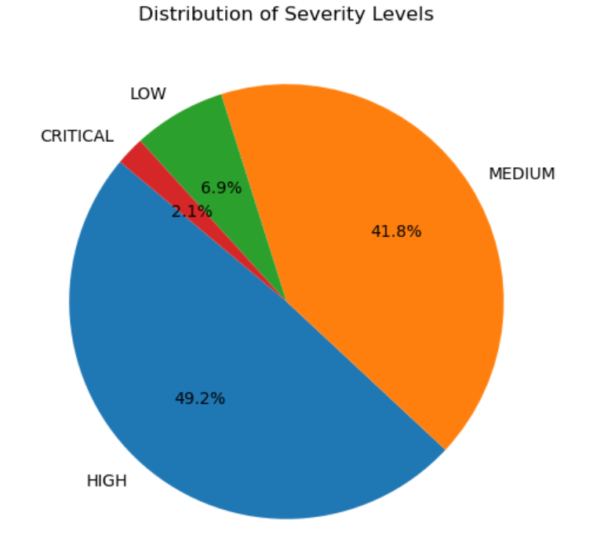
***
## 5. Heatmap visualizes riskiest assets
\
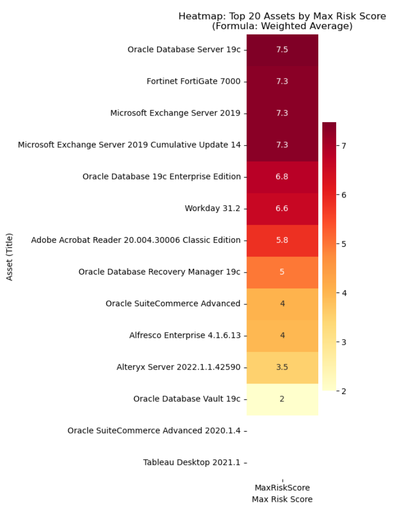
***
## 6. A date range floating slider allows users greater control of their time series analysis
\
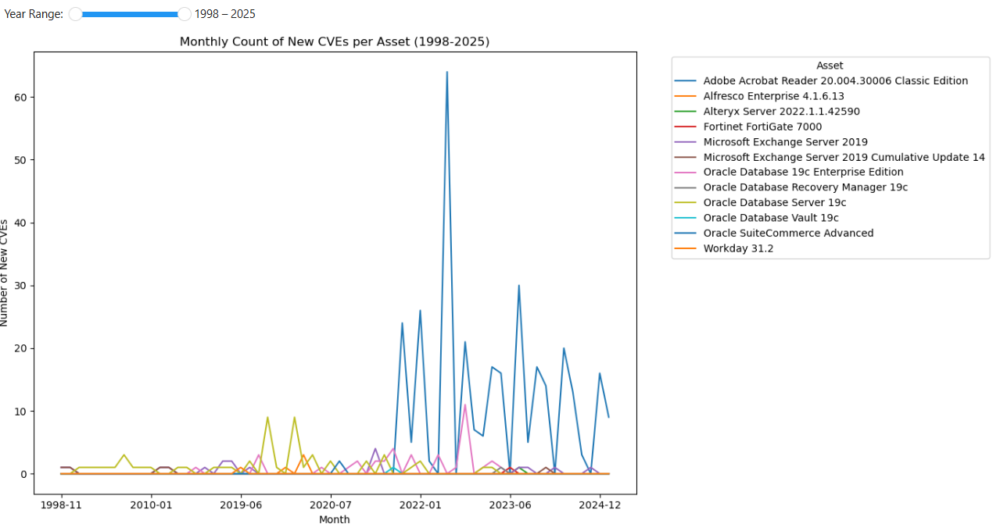
***

# __F4. Mitigation Recommendations__

## Intended Purpose of Code

### Key Features

1. Explain My Top Risk/Mitigations Tips
    * prompt openAI to summarize in a numbered list
        * the users top risks
        * mitigation recommendations to harden systems
3. Risk Trend Insights
    * Calculate quarter over quarter change trends
        * aggregates counts of CVEs by asset and severity
            * grouped by quarter or year
        * groups trends by by period, asset, and severity
    * Prompt openAI to
        * analyze the trend data
        * highlight emerging risk patterns
        * narrate where there were significant spikes or drops
        * call out assets with the most notable changes

# __F4. Mitigation Recommendations Screenshots__

## 1. Explain My Top Risks + Mitigation Tips prompt
***
\
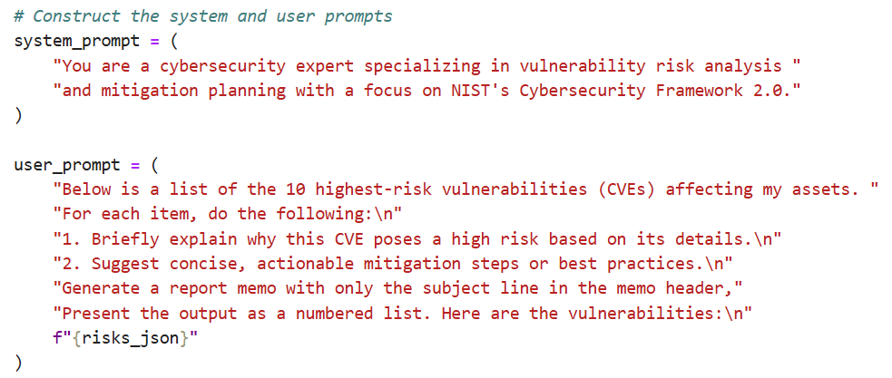
***
## 2. Explain My Top Risks + Mitigation Tips response
***
\
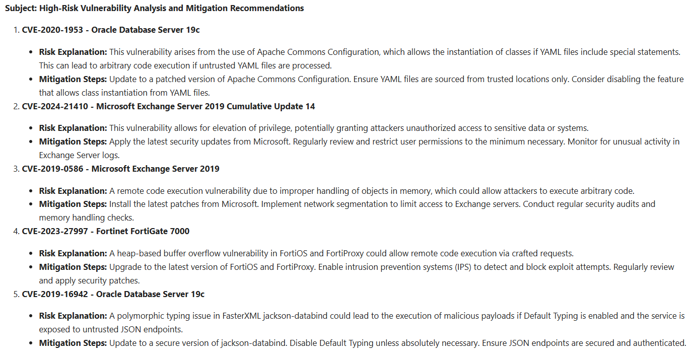
***
## 3. Risk Trends Insight prompt
***
\
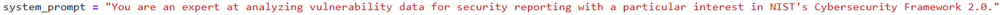\
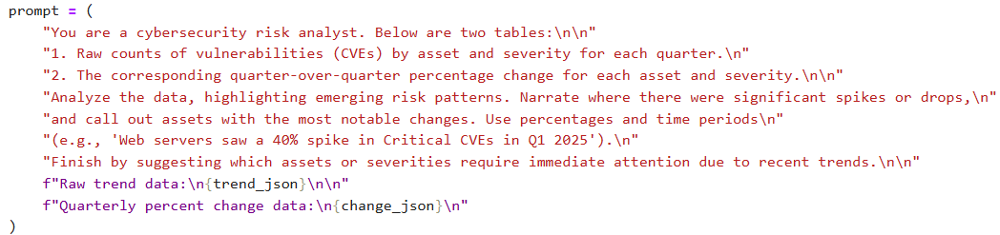
***
## 4. Risk Trends Insight response
***
\
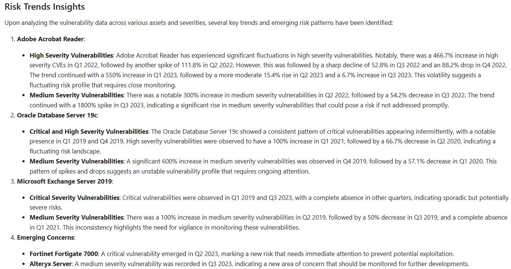\
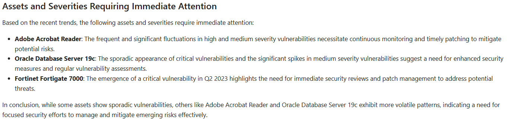
***

##### Check out the streamlit webapps for this project at:
* [CPE/CVE Retrieval Tool](https://cpe-cve-retrieval.streamlit.app/)
* [Risk Scoring Dashboard](https://f3-risk-scoring.streamlit.app/)

##### Documentation, code, data, and images for this project can be found on my github repository:  [hgbtx/cyber-risk-scoring](https://github.com/hgbtx/cyber-risk-scoring/)


```python

```
